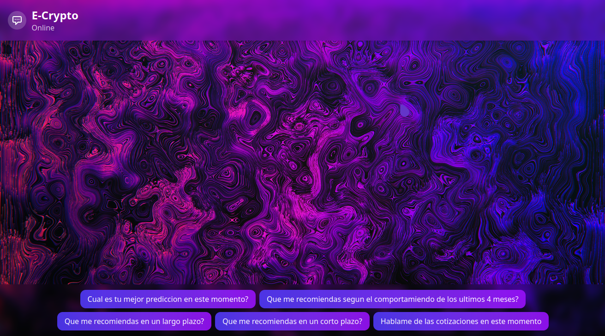

# E-Crypto
Plataforma cripto con API (FastAPI), scrapers en tiempo real, análisis OLAP y predicción de precios con LSTM, visualizado en Streamlit.

## Recomendación para el flujo de trabajo - Initializer steps

initializer steps
1. pip install -r requirements.txt
2. cd public/ -> npm install -> npm run dev
3. cd src/ -> python run_server.py
4. cd src/ -> python -m streamlit run app.py

 
